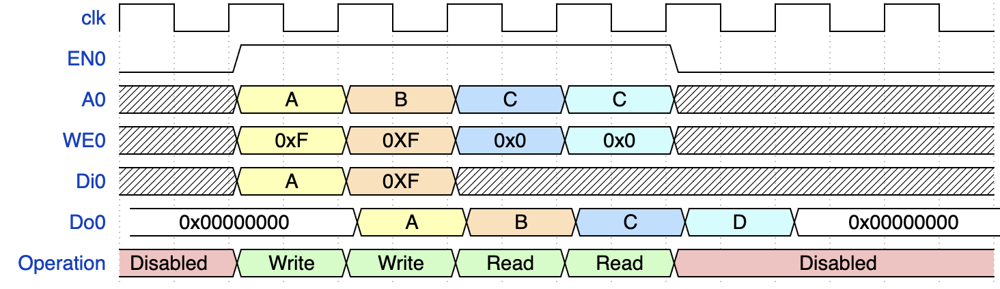
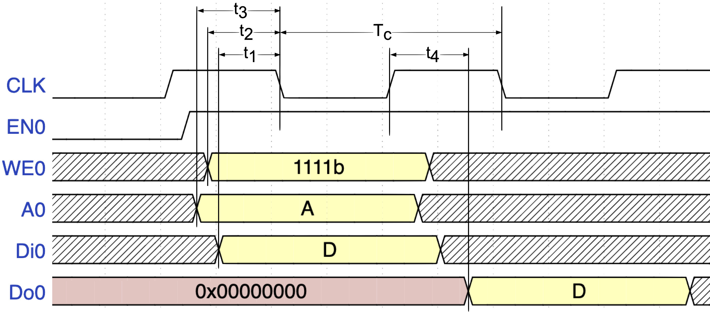

# OL-DFFRAM
OpenLane hardened DFFRAM macros. This repo provides three ready to use single port DFFRAM macros:
- 128x32 (512 bytes)
- 256x32 (1024 bytes)
- 512x32 (2048 bytes)

## Read and Write Operations
The DFFRAM adheres to the SRAM read/write operation. The following timing diagram explains its operation.


## Timing Parameters

|Parameters         |DFRAM128x32|DFFRAM256x32   |DFFRAM512x32   |
|-------------------|-----------|---------------|---------------|
|T<sub>C</sub> (min)| 25 ns     | 25 ns         | 25 ns         |
|T<sub>1</sub> (min)| 6.8303 ns | 4.7618 ns     | 3.2919 ns     |
|T<sub>2</sub> (min)| 9.6186 ns | 8.6898 ns     | 8.4561 ns     |
|T<sub>3</sub> (min)| 6.7498 ns | 4.7148 ns     | 3.7977 ns     |
|T<sub>4</sub> (max)| 7.7625 ns | 11.2799 ns    | 17.4558 ns    |

## DFFRAM dimensions
|IP                 |W(um)      |L(um)          |
|-------------------|-----------|---------------|
|DFRAM128x32        |553.890    |564.610        |
|DFRAM256x32        |1153.835   |536.015        |
|DFRAM512x32        |1186.960   |1021.295       |


## Installation

### To install OL-DFFRAM via IPM (recommended)

Make sure that you have IPM installed locally, to install IPM please [follow the instructions in IPM's repo](https://github.com/efabless/IPM)

After making sure that IPM is installed, you can install DFFRAM using:

```
    ipm install DFFRAM<size>

    #For example
    ipm install DFFRAM256x32
```

### To install OL-DFFRAM manually (not recommended)

Clone the OL-DFFRAM repo and use it inside your project

```
    cd <your_project_root>
    git clone https://github.com/efabless/OL-DFFRAM.git
```
